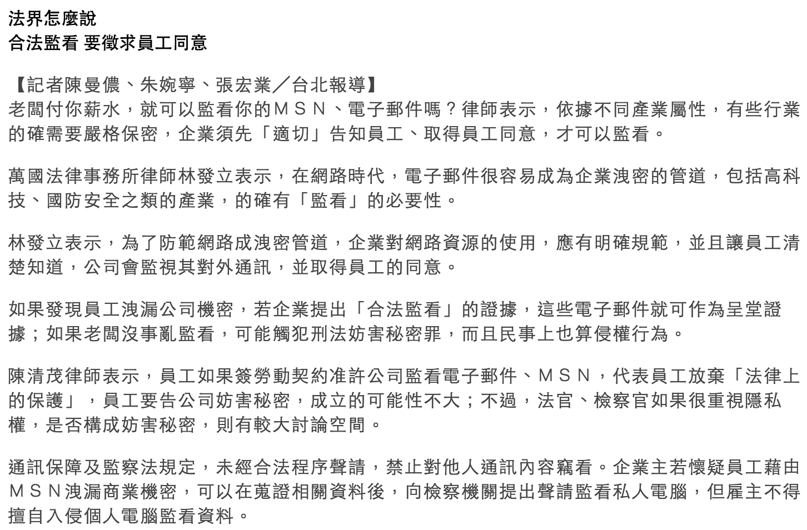

# 反監控

續上篇 [監控概論](monitoring.md) 

這篇是給一般群眾面向的“監控概論”，專注在怎麼樣在各種監控中保護自己

反監控

*   怎麼感知對方有在監控你，以及怎麼繞過這些監控設備
*   我們談怎麼釐清自己的資料，以及怎麼樣做出更安全的行為

如果你是一個監控者、駭客

*   最後有餘力，我們來談談反反監控。怎麼樣在駭客跟使用者各種的迴避手段中，找到保護自己企業的方法。
*   然後，我們後面會開一個專題來談，使用者行為分析，讓身為一個監控者可以真正掌握你的使用者（如果有時間的話ＱＱ

前一章 [監控概論](monitoring.md) 

下一章 [反反監控](anti-anti-monitoring.md) 

## 那我們該如何自保？

首先，我們得知道，我有哪些東西需要被保護

**資訊盤點**

講出來的秘密不是秘密

任何東西上了網路，遲早是公開的。

*   你是什麼身份？
    *   正直好青年/糟糕人/社會運動者/獨立記者/系統管理者/機密持有者/偏執狂？
*   哪些資訊可以公開？
*   哪些資訊需要保護？
*   哪些資訊絕對不可公開？
*   我可能會惹上什麼等級的對手？
    *   如果你身為一個記者或任何可能惹上老大哥的角色...
[https://theinitium.com/article/20170215-dailynews-Snowden/](https://theinitium.com/article/20170215-dailynews-Snowden/)    
[https://zh.wikipedia.org/wiki/%E7%AC%AC%E5%9B%9B%E5%85%AC%E6%B0%91](https://zh.wikipedia.org/wiki/%E7%AC%AC%E5%9B%9B%E5%85%AC%E6%B0%91)

**自我保護的階段**

*   他看得到我的內容，並且可以操控
*   他知道我去哪，但看不到我的內容
*   他不知道我的存在
*   他看得到我，可以拿到一些東西，但不會引起任何注意
*   他拿到我的資料對我無法產生威脅

**對策**

*   環境強化：確保自己有安全的環境
*   偵測：我怎麼知道有人在監控我？
*   繞過：我該怎麼樣避免被監控？
*   反反制：網管如何對抗翻牆？

*   終極的防禦措施否存在？

## 環境強化

**基礎裝備盤點**

請協助補完<(\_ \_)>

*   乾淨的電腦
    *   乾淨安裝的作業系統（定時重灌）
    *   確保安裝程式的來源都是安全的（小心破解程式）
    *   留意執行檔！
    *   安全性更新！！（軟體生命週期）
    *   留意更新！！！（更新的本質）
    *   防毒、防火牆？
*   檢查你的網路環境
    *   怎麼判斷網路是否安全？
    *   公司？家裡？哪個國家？什麼ISP？
    *   留意用戶合約/僱員同意條款/法規
    *   對於不安全的網路，請使用VPN穿越到你可以信任的地方（詳見[穿牆術](https://github.com/sakura26/DADA/blob/master/anti-monitoring.md#穿牆術) ）

## 給技術人的分水嶺

ＯＫ，如果你是一個普通人，看到以上，你就已經比大多數人有能力掌握你自己的資料

如果你是技術人、駭客、網管，我們繼續看下去

我是不是該開一個 給偏執狂 的介紹...?

## 偵測
**最簡單的探測方法**

首先，加入一家公司（或一個國家）之前，合約（法律）務必看清楚

偵測技術大致上可以分成幾大類

**偵測技術類別與偵測**

*   側錄：大致上來說無從探知（但混雜模式可被探測）
*   MITM：中間人攻擊需要偽裝與代換，所以有機會探知
*   探測：有點難搞，但是一般來說有機會探知（需要同時得到來源與目標的記錄）
*   後門：主機、網路鑑識技巧與動靜態分析
*   政策：合約、法律閱讀

**企業常見的監控方式偵測**

*   網路流量分析

    *   流量側錄（Gateway）
    *   網站瀏覽（WebFilter、DNS、MITM）
        *   HTTP Proxy代理
            *   [http://slides.com/sakura26/uservsdefense/#/26](http://slides.com/sakura26/uservsdefense/#/26)
            *   [http://amibehindaproxy.com/](http://amibehindaproxy.com/)
        *   直接封包解析
        *   DNS紀錄
        *   郵件通訊（Server、Gateway、MITM）
    *   即時通訊（Gateway）
    *   關鍵字\檔案偵測（Gateway）
*   資料外洩偵測（Host / Gateway）DLP
*   電話系統側錄（Server）
*   行動裝置（Backdoor）
    *   BYOD企業不能違反法令放隱藏的後門，所以一般會以app型態出現
    *   留意憑證
*   後門與遙控
*   地理位置追蹤
*   實體（Server）

**釣魚**

## 那，該怎麼繞過呢？

看完偵測方式，來看看怎麼避免被監控

*   側錄：加密、混淆、隱藏、別走同一條路
*   MITM：混淆、別走同一條路
*   探測：偽裝、動態位址、行為特徵辨識
*   後門：虛擬化、多重開機、架空後門、BYOD
*   政策：不該簽的合約別亂簽

## 穿牆術

綜合加密、混淆、繞過的手段，實現不被阻擋控制

### 初級班

*   公司的防火牆限制內對外傳輸只有80 / 443能走

**HTTP / Socket Proxy**

這個太入門了，不懂請Google

中國不擋，因為能解

[https://zh.wikipedia.org/wiki/%E4%BB%A3%E7%90%86%E6%9C%8D%E5%8A%A1%E5%99%A8](https://zh.wikipedia.org/wiki/%E4%BB%A3%E7%90%86%E6%9C%8D%E5%8A%A1%E5%99%A8)

anonymous proxy list: 

Browser addons: [foxyproxy](https://addons.mozilla.org/zh-tw/firefox/addon/foxyproxy-standard/) 

風險：如果該Proxy提供者被接管或有惡意，他能夠側錄你所有的流量！

自己架設是一種解法

**WebProxy**

注意：他可以幫你繞過封鎖，但是沒有加密與混淆！

不好擋，但因為能解所以...

線上服務：[http://anonymouse.org/anonwww.html](http://anonymouse.org/anonwww.html)

自己架設（記得順便上SSL跟憑證）

著名的PHProxy

[https://zh.wikipedia.org/wiki/PHProxy](https://zh.wikipedia.org/wiki/PHProxy)

其他替代方案

[http://alternativeto.net/software/phproxy/](http://alternativeto.net/software/phproxy/)

**即時通訊軟體**

[Telegram](https://telegram.org/)

以強大的安全性與隱私性作為出發點

通訊皆有加密，也可以啟用更高私密性的點對點連線

OpenSource Client, CloseSource Server

Server會儲存一般通訊的紀錄

一般來說，管理團隊不審查內容（請自行考慮）

中國拿他沒輒，所以也是封鎖的

[Signal](https://whispersystems.org/) 

以強大的安全性與隱私性作為出發點

通訊皆有加密，也可以啟用更高私密性的點對點連線

OpenSource Client, OpenSource Server

目前被認為是比Telegram更加安全的選擇

*   我沒怎麼在用，有人能分享心得嗎？

進階：自行架設

XMPP通訊協定，可以選擇加密，可以自己掌握通訊密鑰

[https://zh.wikipedia.org/wiki/XMPP%E5%8D%94%E8%AD%B0%E4%BC%BA%E6%9C%8D%E5%99%A8%E8%BB%9F%E9%AB%94%E5%88%97%E8%A1%A8](https://zh.wikipedia.org/wiki/XMPP%E5%8D%94%E8%AD%B0%E4%BC%BA%E6%9C%8D%E5%99%A8%E8%BB%9F%E9%AB%94%E5%88%97%E8%A1%A8)

我之前架設的是OpenFire，還算簡易好用

[http://www.igniterealtime.org/projects/openfire/](http://www.igniterealtime.org/projects/openfire/)

如果希望支援多媒體，也有擴充協定

[https://conversations.im/omemo/](https://conversations.im/omemo/)
<undefined><li>**中級班**</li>
<li>**VPN**</li></undefined>

**<s>PPTP</s>**

（中國不擋，因為它能解...）

地雷！別用！！！雖然他曾經是最廣為使用的加密方式，但是已經可以被即時破解了！

**L2TP**

（中國可能會擋）

基於IPSec的加密，架設難度較高，還沒被破解（但我覺得也沒很安全）

許多NAS、防火牆、網路設備有內建

**OpenVPN**

（中國擋很大，因為它解不開）

目前相當廣為使用的加密系統，靈活穩定，但配置難度也較高

支援Site 2 site, client server, TCP & UDP mode

[https://openvpn.net/index.php/open-source/downloads.html](https://openvpn.net/index.php/open-source/downloads.html)

現在許多NAS、防火牆、網路設備有內建

[https://pritunl.com/](https://pritunl.com/)

設定檔管理與建立、主機部署、Single SignOn、登入稽核、OpenSource

**SSLVPN**

（中國隨機擋）

常見於商業防火牆方案，基本上就是透過443與SSL走加密連線，[長得像這樣](https://sslvpn2.ntu.edu.tw/dana-na/auth/url_default/welcome.cgi) 

Fortigate SSLVPN  

*   請留意NSA後門問題....

自己架？ [OpenVPN-als](https://sourceforge.net/projects/openvpn-als/)  

*   前身adito, 一個很WTF的套件，Java based，跑在Linux搞半天一堆問題，結果Windows一次就過...

**Tor**

（中國會擋）

[洋蔥路由](https://zh.wikipedia.org/wiki/Tor) ，早期常用的翻牆軟體，但現在阻擋技術進步，行不太通了，反而是在牆外很流行。

Overlay Network

有出[自己的瀏覽器](https://www.torproject.org/projects/torbrowser.html.en) （與Firefox綁定）

暗網darknet .onion

留意出口節點的問題

假節點

NSA對Tor的監控

有興趣的話，延伸閱讀：[Freenet](https://zh.wikipedia.org/wiki/%E8%87%AA%E7%94%B1%E7%BD%91) 

**其他**

[自由門](https://zh.wikipedia.org/wiki/%E8%87%AA%E7%94%B1%E9%97%A8) 、無界瀏覽、puff、[shadowsocks](https://zh.wikipedia.org/wiki/Shadowsocks) 、[GoAgent](https://zh.wikipedia.org/wiki/GoAgent) 

日系高隱私性p2p  [winny](https://zh.wikipedia.org/wiki/Winny) /[share](https://zh.wikipedia.org/wiki/Share) /[perfectdark](https://zh.wikipedia.org/wiki/Perfect_Dark) 

**商業VPN?**

比較不容易被擋（他們會幫你喬）

優勢：幫你跳全世界不同國家不用到處找<s>肉雞</s>跳板

問題：你信任他嗎？

*   PS : 如果是用別人信用卡, 真的出了什麼事情, 這樣隔了一層關係, 會相對很難查 XD 
*   也不一定... 暗網都能追了

**Remote Desktop**

（中國不擋）

MS的協定，速度還不錯，但是中國使用有點悲劇，尤其在loading有動畫的網頁時

小心被攻擊

**Teamviewer**

大體上同上，但是安全性有疑慮
<undefined><li>**高級班**</li></undefined>

**SSH Tunnel**

*    其實ssh tunnel有可能會被擋就是w
*   事實上很好擋，因為很容易辨識，但是中國比較少一開場就擋，因為畢竟還是網管的主要工具，而且很容易開分身，所以還是很好用的

Linux/mac下直接下指令就好，Windows可以用putty

建立Socks proxy

*   ssh -NfD 8888 remote_ip

建立點對點通道

*   ssh -NfL 2323:bbs.gamer.com.tw:23 remote_ip

搞定DNS（UDP tunnel）

*   這個我還沒試出來，待測

*   local# ssh -L 6667:localhost:6667 server
**   server# mkfifo /tmp/fifo
*   server# nc -l -p 6667 < /tmp/fifo | nc -u 192.168.1.1 53 > /tmp/fifo

*   這一段會報錯

**   local# mkfifo /tmp/fifo
*   local# sudo nc -l -u -p 53 < /tmp/fifo | nc localhost 6667 > /tmp/fifo

[http://zarb.org/~gc/html/udp-in-ssh-tunneling.html](http://zarb.org/%7Egc/html/udp-in-ssh-tunneling.html)

維持連線

*   autossh

強制指定走加密通道

*   ProxyChains

*   [https://wizardforcel.gitbooks.io/daxueba-kali-linux-tutorial/content/11.html](https://wizardforcel.gitbooks.io/daxueba-kali-linux-tutorial/content/11.html)

進階技巧：端口轉發跟反向連結

*   你是一個行動裝置的開發者，在自己公司裝了一個溫濕度感應器。網管不讓你開port到外面所以你沒辦法在外面持續修改該設備，所以你決定自己來
*   ssh -NfR 2222:localhost:22 remote_ip

*   到了機場，機場的WIFI面露邪佞的笑容跟你收取每MB 1USD的高額價碼

**DNS Tunnel**

[http://code.kryo.se/iodine/](http://code.kryo.se/iodine/)

**ICMP Tunnel**

[http://code.gerade.org/hans/](http://code.gerade.org/hans/)
<undefined><li>**財財**</li></undefined>

**Meraki**

[http://www.vssecurity.com.tw/meraki](http://www.vssecurity.com.tw/meraki)

**土砲王**

自幹協議、流量分散、混淆

實務上，我去中國前都會配置多個不同方案，因為中國的阻擋能力相當的強，得要換著用

也曾經遇到所有跳板全滅的狀況，備案很重要，請至少保留一兩條的線讓你有辦法去開VPS或是其他service

**穿牆術的濫用問題**

*   K島聲優廚

## 其他穿牆術

你是一個駭客，進入到一家防禦嚴密的公司內。你的社交工程成功在值班櫃檯的Windows電腦上埋下一個反射式後門，現在是下班時間，你想直接登入桌面看個究竟...

**lcx.exe 內網端口轉發**

[http://www.111cn.net/sys/Windows/76766.htm](http://www.111cn.net/sys/Windows/76766.htm)

*   linux則有nc

你撰寫了一隻病毒，打算把它植入到一間保護嚴密的公司內。你已經丟了好幾隻病毒進去卻了無音訊，因此你決定用一個最保險的方式來讓病毒回到你的掌握中

**plurk反向後門**

你只想隱藏某個簡單的文字訊息

**SPAMMIMIC**

[http://www.spammimic.com/](http://www.spammimic.com/)

**匿名郵件服務**

[http://anonymouse.org/anonemail.html](http://anonymouse.org/anonemail.html)

**實體安全**

門禁紀錄、監視技巧

我們留到實體安全那章來談

## Tunnels in a box

有去過中國的就會知道，雖然我們有這麼多防禦技術，但是並不完善：當你在網路與網路之間切換，VPN尚未連接上的瞬間，你是毫無保護的。對於一個偏執狂來說，輕則資料外洩，重則被植入後門、老大哥知道你在這裡，然後就被買普洱了（？）

我們需要一個全通透、可信任、寧願沒有網路也不可讓自己裸奔的法寶...
<undefined><li>**現成套件**</li></undefined>

[https://netaidkit.net](https://netaidkit.net)

[http://store.netgate.com/SG-1000.aspx](http://store.netgate.com/SG-1000.aspx)

Example of some other similar ones

[https://www.indiegogo.com/projects/betterspot-a-smart-vpn-router-for-all-devices-security#/](https://www.indiegogo.com/projects/betterspot-a-smart-vpn-router-for-all-devices-security#/)

[https://www.indiegogo.com/projects/shellfire-box-vpn-evolution-security-technology#/](https://www.indiegogo.com/projects/shellfire-box-vpn-evolution-security-technology#/)

[https://www.indiegogo.com/projects/anonabox-access-deep-web-tor-privacy-router#/](https://www.indiegogo.com/projects/anonabox-access-deep-web-tor-privacy-router#/)

[https://www.indiegogo.com/projects/invizbox-privacy-made-easy#/](https://www.indiegogo.com/projects/invizbox-privacy-made-easy#/)

And check out the prices on Amazon

[https://www.amazon.com/Anonabox-PRO-Wi-Fi-Tor-Router/dp/B01AYC27YK/](https://www.amazon.com/Anonabox-PRO-Wi-Fi-Tor-Router/dp/B01AYC27YK/)

如果你有Raspberry pi, 可以自行安裝這個套件

[https://pi-hole.net/](https://pi-hole.net/)
<undefined><li>**硬體**</li></undefined>

[https://world.taobao.com/item/523387222035.htm?fromSite=main](https://world.taobao.com/item/523387222035.htm?fromSite=main)

[https://item.taobao.com/item.htm?spm=a230r.1.14.88.7NHRc0&id=42154745826&ns=1&abbucket=9#detail](https://item.taobao.com/item.htm?spm=a230r.1.14.88.7NHRc0&id=42154745826&ns=1&abbucket=9#detail)

## 網頁瀏覽反制技巧

**瀏覽器防禦**

攻擊技巧

*   Cookie與etag身份識別
*   惡意addons
*   站點間的私下協議
*   瀏覽器exploit
*   XSS與偷密碼登別的帳號

反制

*   阻止程式執行：NoScript
*   切斷身份識別：隱私模式
*   調整行為模式

## 其他

**取代可能被監控的軟體**

粉碎稜鏡（[prism-break.org](https://prism-break.org) ），由 Peng Zhong 設立的網站，與[電子前哨基金會](https://zh.wikipedia.org/wiki/%E7%94%B5%E5%AD%90%E5%89%8D%E5%93%A8%E5%9F%BA%E9%87%91%E4%BC%9A)並沒有任何正式關係。[[37]](https://zh.wikipedia.org/wiki/%E7%A8%9C%E9%8F%A1%E8%A8%88%E7%95%AB#cite_note-44)「粉碎稜鏡」列出眾多[非盈利組織](https://zh.wikipedia.org/wiki/%E9%9D%9E%E7%9B%88%E5%88%A9%E7%BB%84%E7%BB%87)所撰寫發布的各種[自由軟體](https://zh.wikipedia.org/wiki/%E8%87%AA%E7%94%B1%E8%BD%AF%E4%BB%B6)，從取代Windows和Mac     OS的作業系統，到各式各樣的常用軟體，以及去中心化的網路服務（電子郵件、雲端儲存和運算等等），都列出了功能、優缺點的比較，以便讓人們取代涉及稜鏡計畫的公司，以及他們所製作的、以盈利為目的或者封閉源碼之商業軟體和服務，來保護隱私，躲避例如美國、英國政府的監控。

*   避開偵查的範例
*   [https://zh.wikipedia.org/wiki/%E7%AC%AC%E5%9B%9B%E5%85%AC%E6%B0%91](https://zh.wikipedia.org/wiki/%E7%AC%AC%E5%9B%9B%E5%85%AC%E6%B0%91)

Mac防火牆

[http://alternativeto.net/software/little-snitch/](http://alternativeto.net/software/little-snitch/)

**魔法**

量子秘鑰

透過一對光子的[量子纏結](https://zh.wikipedia.org/wiki/%E9%87%8F%E5%AD%90%E7%BA%8F%E7%B5%90) ，資訊可以在不通過任何介質的情況下進行傳遞，實現超空間通訊

[https://zh.wikipedia.org/wiki/%E9%87%8F%E5%AD%90%E5%AF%86%E9%91%B0%E5%88%86%E7%99%BC](https://zh.wikipedia.org/wiki/%E9%87%8F%E5%AD%90%E5%AF%86%E9%91%B0%E5%88%86%E7%99%BC)

*   已經於2003年商業化，日內瓦的id Quantique公司和位於紐約的MagiQ技術公司，推出了傳送量子密鑰的距離超越了貝內特實驗中30厘米的商業產品
*   [http://www.people.com.cn/BIG5/keji/25892/3090189.html](http://www.people.com.cn/BIG5/keji/25892/3090189.html)
*   標題應該是量子密鑰? 量子密碼學另有演算法，如 GGH 跟 NTRUE
*   感謝指正 <(_ _)>
*   https://tomorrowsci.com/science/%E7%A7%91%E5%AD%B8%E5%AE%B6%E5%B0%87%E5%85%89%E5%AD%90%E7%9E%AC%E9%96%93%E8%BD%89%E7%A7%BB%E5%85%AD%E5%85%AC%E9%87%8C/

**怎麼查詢憑證的指紋是否正確？**

[https://www.grc.com/fingerprints.htm](https://www.grc.com/fingerprints.htm)

FB的憑證追蹤 

[https://www.inside.com.tw/2016/12/28/facebook_for_developers_certificates](https://www.inside.com.tw/2016/12/28/facebook_for_developers_certificates)

[https://developers.facebook.com/tools/ct](https://developers.facebook.com/tools/ct)

**我的密碼安全嗎？**

[https://www.grc.com/haystack.htm](https://www.grc.com/haystack.htm)

**翻進去？**

[https://www.kocpc.com.tw/archives/4198](https://www.kocpc.com.tw/archives/4198)

VPN Gate

[http://www.vpngate.net/cn/](http://www.vpngate.net/cn/)

*   這一樣是翻進去的方法，當初也是為了針對GFW而設計的服務，用來降低VPN的翻牆門檻(雖然後面VPN已經無法穿牆了)，但因為某一些網站因為某些因素(包含但不一定只監控)有限制區域IP訪問，因此有玩家利用這種方式翻進去

## 如何反制分析

*   通則：切斷可辨識的連結
*   選項：混淆（混入人群中）
    *   引入大量資訊混淆
    *   用自拍累死FBI：監控那個監控你的人
    *   [https://theinitium.com/article/20160904-dailynews-selfies-fbi/](https://theinitium.com/article/20160904-dailynews-selfies-fbi/)

    *   通訊管道越複雜越難以追蹤

*   選項：隱藏（你看不到我）

    *   最小化接觸面積
    *   最小化資料傳輸
    *   盡量避開可被大量監聽的媒介

## 下一章

好吧，講到這裡，我想應該有很多同行覺得我出賣機密罪無可赦了ＸＤＤ

但，問題在於這些並非秘密，而是已經被廣為使用的躲避機制，然後我們真的要抓的惡人往往比這些技巧更加刁鑽。我們必須要有系統性的認知，才有辦法對抗這些有技術有惡意的對手，這也是我們下一章節的內容：

 [反反監控](https://realdefense.hackpad.com/7Ym93Ixn8AC) 