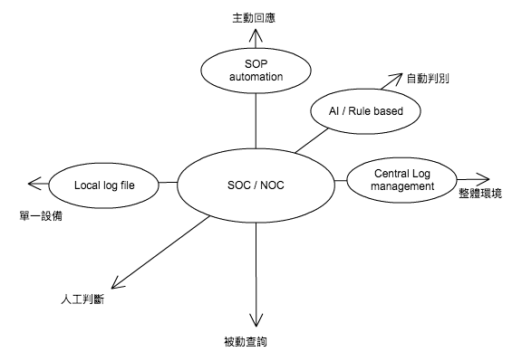

# Log分析

## 前言

我們已經稍微瞭解了Log的重要性，以及如何快速的從Log中找出一些我們想知道的事情。但，想到才去做總還是比不上讓電腦自動把資訊匯總給你，甚至讓電腦自動做出反應，對吧？

這是「戰情分析」系列課程

我們會一路從「Log概論」、「Log分析」、「Log處理」、「SOC」、「資安戰情室」一路深入，最終我們將能掌握自己的系統，看到駭客，並作出回應


_這不是傳統的課程，請不要來「聽課」，腦袋硬梆梆的是做不好資安的，請不吝跟大家分享想法_

另外如果你已經有相當經驗，可以跳過這堂課，但也歡迎來聊天

授權方式 [CC: BY-SA](https://creativecommons.org/licenses/by-sa/3.0/tw/legalcode) 

黑魔法防禦術 FB群組 => [](https://www.facebook.com/groups/308549376151517)[https://www.facebook.com/groups/308549376151517](https://www.facebook.com/groups/308549376151517)

加入請記得回答問題喔，如果一直沒收到加入回覆，請發個訊息跟我聯絡，或看一下收件夾

## 目標

**層次**

* 爆炸了就重灌（喂）
* 發生問題的時候，我可以得到系統發生什麼事
* 發生事情的時候，系統會通知我
* 系統會定期彙整運作狀況給我
* 系統會自動識別異常，並自動做出回應

所以你可能需要

* 保留足夠你分析的Log，包含時間與種類
* 了解你的Log與服務/主機，這樣你才有辦法理解Log裡面的訊息，以及怎麼與其他Log交互
* 建立自動化偵測與通報機制
* 建立Log的收集/儲存/分析/定時匯總
* 自動異常識別規則/ＡＩ/自動回應規則



來看一下
## 完整的Log系統

**Log處理階段**

* 產生
* 收集
* 資料正規化（可省略）
* 儲存
* 分析
* 歸檔存查（可省略）

### 產生階段 

有時，你可能會發現有些問題，Log回答不出來？可能一開始就沒有收集到足夠了解全貌的Log！

這邊主要分成兩個方向

如果你是一般網管，你會需要做好 **Device Tuning** 。很多時候一台設備（或新架設的服務）加入你的環境，他預設的Log level可能不符合你的需求，不是讓你被Log轟炸，就是啥都看不到。你會需要花相當的時間與這個服務相處，了解他怎麼運作的，以及「你想要看到些什麼，讓它記錄下來」。

如果你是開發者，你會需要做好 **Log記錄** 。幾個重點你會想要留意的：

* 記錄：系統執行的重要階段、敏感/特權操作、設定異動、用戶操作、除錯資訊等等
* Log分級（嚴重度/緊急度）*參考syslog
* 選一個好log套件


### 收集階段

許多時候，Log都是分散在不同主機上，你不會想要一台一台登上去看的。如果能將Log收集到一台專屬主機，是不是就方便多了呢？

另一方面，Log本身也有一些討厭的特性，大量的IO與磁碟空間消耗會拖累你的系統效能與資源，如果可以丟到一台專門處理的機器去，那也會對於你的服務穩定度與效能有相當程度的提升

幾個重點你可能會想留意

* Log來源的型態 （File/syslog/DB/...?）
* Log怎麼傳輸 (File/syslog/....?)
* 延遲/壓縮/加密/不可否認性/丟失/重複/竄改等例外處理

### 轉換階段

如果你只需要透過關鍵字去搜尋，那你可以不需要作轉換。但多數情況下關鍵字有其極限所在

例如你想要找出準確的來自123.32.1.23 前往213.32.123.32的Log

```
2017/03/01 00:00:00 tcp 123.32.1.23 12540 213.32.123.32 80 accept
2017/03/01 00:00:01 tcp 213.32.123.32 80 123.32.1.23 12540 drop
```

使用123.32.1.23 與 213.32.123.32關鍵字就難以把上面兩個不同方向的Log分開，而且常常要回頭去翻到底這個格式究竟哪一欄是指什麼

但如果你先把Log解析，把不同數據放到不同欄位中如

```
date:2017/03/01 00:00:00 | protocol: tcp | src_ip: 123.32.1.23 | src_port: 12540 | dst_ip: 213.32.123.32 | dst_port: 80 | action: accept
date:2017/03/01 00:00:01 | protocol: tcp | src_ip: 213.32.123.32 | src_port: 80 | dst_ip: 123.32.1.23 | dst_port: 12540 | action: drop
```

然後透過 src_ip=123.32.1.23 and dst_ip=213.32.123.32 去搜尋，這樣是不是更準確且好理解了呢？

這就是Parser解析器的任務，事先幫你把數據整理好。

還有一個很重要的幫助：協助你可以使用同一套方法去分析各種不同的設備。假設一個連線中間通過兩個防火牆一個proxy, 每個都各有各自的Log形態，這就可以幫助你在一個搜尋中看到不同設備間的交互連動

有些時候，你也會仰賴ETL幫你做一些額外的事，例如把來源IP打上來源國家的額外資訊

當然，你可以省略這一階段。ETL會消耗相當程度的CPU資源，同時可能會增加你的儲存空間壓力（如果你想要同時保存原始證據的話）。目前各家有各家的做法，如Splunk是採取事後解析的模式，而ArcSight則是先解析完儲存起來

> Logs with tags V.S. Parsed information with raw data?

**吐槽**

然後，對，我想你應該已經發現了。這個解析器必須針對不同Log格式分開寫，每個設備都不會一樣 - 這代表寫Parser是一件很煩人又吃技術的事情，一般來說你必須要有程式設計技巧，並熟悉Regular expression才比較能勝任這個工作，而且你得查一堆文件搞清楚到底這個設備的Log會生成多少種格式 - 很多時候，甚至連原廠都沒有提供這樣的文件

還有，Log本身事實上是一種很疏鬆的格式。你永遠不知道程式到底會生成什麼樣的內容搞你：設備升版格式變動、管理員修改了Log格式樣板、某些欄位被塞入了意料之外的值（CSV欄位中有逗號之類），更不用說很多時候Log來源同時會有多個程式寫入（如Syslog）。你勢必得面對，你寫的Parser會有無法解析的內容，以及各種的例外處理。  
<strike>如果有任何人要求你每一筆Log都要對得整整齊齊也不會出問題，請拿一塊熱Pizza砸在他的臉讓並問他有沒有辦法把這塊pizza恢復原狀</strike>

**工具**

一般來說，Log收集與ETL是放在一起的，OpenSource的話有logstash/fluentd等不同選擇，你也可以考慮開發自己的來做一些特別的需求（諸如前面提到的產生國家標籤）

然後由於自己寫parser是很痛苦的一件事，甚至如ArcSight都以他家agent支援的設備格式為主打，現在也有很多OpenSource試著提供一些內建的parser可以使用，如logstash/fluentd都有內建支援Apache access/error Log

### 儲存階段

多數情況下，你不可能持續坐在螢幕前面刷那些log，除了看到眼睛脫窗之外只會搞死自己。一般來說Log總還是會儲存起來以備後續分析之用，可能為了證據力還要保留原始紀錄，放個幾年之類的，所以問題就來惹

如果你有幾台很忙碌的Web Server, 一天Log量就有8-10G，保存三年 = 準備10T的儲存空間 ＸＤＤ

然後一般來說Log一旦歸檔，就不再允許變更了。

可擴容性、管理便利度、安全性、成本、搜尋、備份等會是這邊的考量點

也會考慮到如果儲存空間已滿的時候該怎麼辦：覆蓋或終止？（資料爆量）

**硬體特性**

大體上，硬體需求有幾個重點：耐久、大容量

因為Log的特性是循序寫入讀取，所以一般來說儲存可以使用較為便宜的SATA硬碟，但RAID還是跑不掉，因為三年內硬碟不壞是不可能的

又假設如果存放的是解析資料如ArcSight存在數據庫中，那硬碟的隨機存取能力也還是需要的。

**工具**

有一些工具可以協助你儲存，甚至提供搜尋與分析的能力

* Relational DB (Mysql/Oracle...)
* ElasticSearch / InfluxDB ...
* Hadoop
* File based

### 分析階段

大體上來說，Log都已經儲存起來了，接下來想用什麼工具來處理都好。如果你前面已經資料放到Elasticsearch之類的平台中，可以直接用如Kibana/Grafana的介面直接進行管理分析，或是把數據導往Qlik之類的平台協助你視覺化，了解現況

大體上來說分析有幾塊

* 趨勢報表
* 即時告警
* 逐行檢視


## 實戰

### iptables Log

首先，從Log來源開始

iptables是Linux內建的防火牆，但他預設是不會留下任何紀錄的。如果你想要在某些流量或某些動作時留下紀錄，你會需要寫Log規則：

<http://www.thegeekstuff.com/2012/08/iptables-log-packets/?utm_source=feedburner>

``` 
iptables -N LOGGING
iptables -A INPUT -j LOGGING
iptables -A LOGGING -m limit --limit 2/min -j LOG --log-prefix "IPTables-Dropped: " --log-level 4
iptables -A LOGGING -j DROP
```

生成出來的Log會長的像這樣

```
Aug  4 13:22:40 centos kernel: IPTables-Dropped: IN= OUT=em1 SRC=192.168.1.23 DST=192.168.1.20 LEN=84 TOS=0x00 PREC=0x00 TTL=64 ID=0 DF PROTO=ICMP TYPE=8 CODE=0 ID=59228 SEQ=2
Aug  4 13:23:00 centos kernel: IPTables-Dropped: IN=em1 OUT= MAC=a2:be:d2:ab:11:af:e2:f2:00:00 SRC=192.168.2.115 DST=192.168.1.23 LEN=52 TOS=0x00 PREC=0x00 TTL=127 ID=9434 DF PROTO=TCP SPT=58428 DPT=443 WINDOW=8192 RES=0x00 SYN URGP=0

```

這個案例，我們使用Regex來進行分析，使用線上工具來協助我們撰寫Regex <http://www.regexplanet.com/advanced/java/index.html>

我們有興趣的欄位主要有 SRC DST PROTO (僅是舉例)，所以我們試著寫出一條Regular expression來抓取他

```
([A-Z][a-z][a-z]\s+\d+)\s+(\d+:\d+:\d+)\s+(\S+)\s+(\S+):\s+IPTables-Dropped:\s+.*\s+SRC=(\d+\.\d+\.\d+\.\d+).*\s+DST=(\d+\.\d+\.\d+\.\d+).*\s+PROTO=(\S+).*
```

有了這條Regex，你就可以試著使用logstash/fluentd的regex功能來對你的Log進行解析

當然，這是僅就我們看到這兩條Log進行分析。如果回頭看iptables原廠的log的話，你肯定會覺得有點毛毛的

<http://logi.cc/en/2010/07/netfilter-log-format/>

你會注意到，欄位順序並不保證，同時有些欄位是“可能出現可能不出現”的，這有可能會導致你的程式無法抓到這條log, 或是做出錯誤的動作。這個時候我們就要來談談Log格式了

## Log格式

關於Log解析，你可能會遇到幾種不同類型的數據風格，不同的風格適合不同的解析方式

### 常見格式

*   固定字元分隔
*   固定長度分隔
*   key-value
*   JSON
*   XML
*   自然語言
*   混合

### 欄位的常見格式

*    字串
*    數字
     *   整數
     *   浮點數
     *   科學記號
     *   0xF
*    時間
     *   timestamp / epoch / unix timestamp
     *   mysql time format
     *    跨時區分析
*    ID
     *   數字遞增
     *    UID / GUID   18A90565AF7E-552E04EF-007B-5C78-DF19
     


同時也有一些大廠跳出來，試圖制定出統一世界的格式，如
### CEF

```
CEF: 0|PATownsend|IBM-QAUDJRN|1.28|1007|CO-Create object|4|msg=CO-Create object act=N-Create of new object actual_type=CO-N jrn_seq=102361 timestamp=20120229154725823000 dproc=ICC suser=MVAGANEK job_number=638012 eff_user=MVAGANEK object=X_BIGNUM object_library=ICAPITST object_type=*MODULE object_attrCLE
```

好像寫太多了....剩下的放到下次再提？
     
## 弱點與駭客攻擊


### 駭客的目標

*   抹除蹤跡
*   誤導方向
*   探索內部、搜尋攻擊目標
*   直接攻擊高權限的管理者

### 攻擊手法與對抗手法

*   篡改內容
    *   換行字元
    *   假造欄位資訊
    *   超長數據覆蓋
    *   格式破壞
    *   XSS / SQL injection
*   刪除檔案
*   Span

### 權限配置

如前面提到的，駭客對於log的興趣與可以獲得的利益遠比系統管理者還大，所以避免log被隨意讀取是非常重要的事情

-rw-r-----  640是常見的配置 

可公開的log才會出現644

進階安全性：append only

*   chattr +a test.log

或SELinux

但，根據對方打得深入程度，本機的安全性遲早會被破的，所以Log的異地備援與即時分析成為了重點

吸血鬼牙