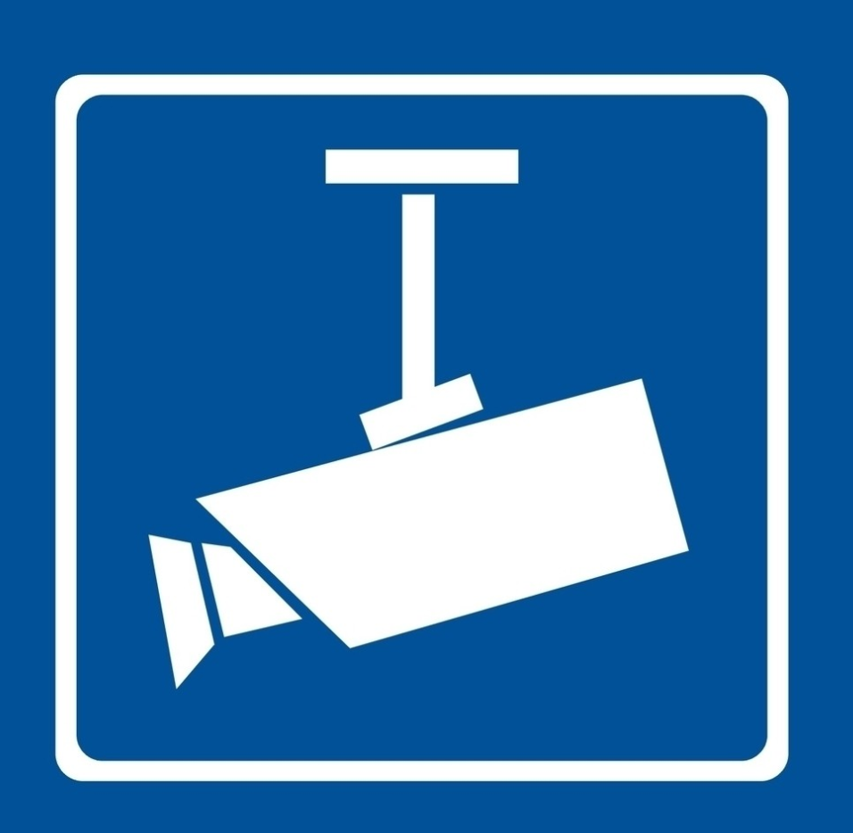
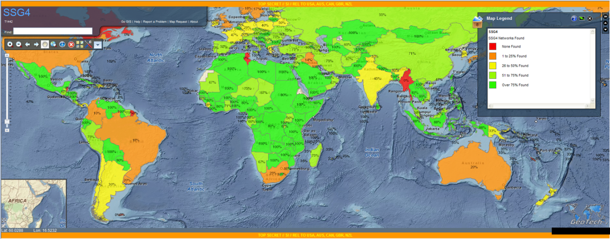
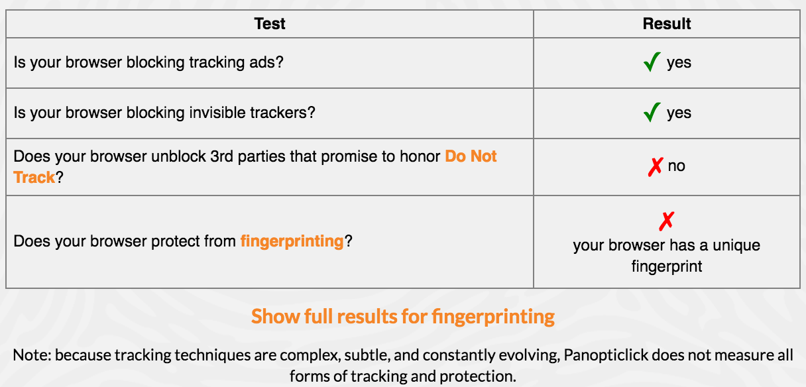

# 監控

很多人已經習慣了路面上到處出現的監視器，註冊FB或安裝軟體的時候也很習慣地忽略授權條款連點"下一步"，彷彿這個世界多麽和善，廠商提供免費服務讓世界更好....（笑

**今天，我們談監控**

這篇是給一般群眾面向的“監控概論”，專注在下列

監控

*   我們會先介紹監控，看看現在世界各國的能力到底強大到什麼程度，以及他們到底可以對你做什麼
*   我們談監控的理由，為什麼監控是必要的？我們究竟為了什麼犧牲自己的隱私？

[反監控](/9uW38ZTkPbS) 

*   再來，我們來談反監控。怎麼感知對方有在監控你，以及怎麼繞過這些監控設備
*   我們談怎麼釐清自己的資料，以及怎麼樣做出更安全的行為

[如果你是一個監控者、駭客](/7Ym93Ixn8AC) 

*   最後有餘力，我們來談談反反監控。怎麼樣在駭客跟使用者各種的迴避手段中，找到保護自己企業的方法。
*   然後，我們後面會開一個專題來談，使用者行為分析，讓身為一個監控者可以真正掌握你的使用者（如果有時間的話ＱＱ

_這不是傳統的課程，請不要來“聽課”，腦袋硬梆梆的是做不好資安的，請不吝跟大家分享想法_

另外如果你已經有相當經驗，可以跳過這堂課，但也歡迎來聊天

授權方式 [CC: BY-SA](https://creativecommons.org/licenses/by-sa/3.0/tw/legalcode) 

黑魔法防禦術 FB群組 => <https://www.facebook.com/groups/308549376151517>

## I AM WATCHING YOU

### 場景

*   在中國

如果你在網上發帖或者寫文章時使用了諸如「六四」、「法輪功」等敏感詞的話，這個帖或文章肯定是發不出來的——不但發不出來，發帖者還可能因此遭遇各種麻煩。

<http://www.epochtimes.com/b5/tag/%E7%B6%B2%E8%B7%AF%E7%9B%A3%E6%8E%A7.html>

*   在美國

倘若一個人，有能力隨時知道“你”，“在哪裡”，“做什麼”，看到你的“過去”，操控你的“未來”....

這就是美國國家安全局NSA現在擁有的實力，也是之所以持有“老大哥”稱號的理由

*   在台灣

雖然上網幹老闆不會被神隱，但依然可能被秋後算帳。

另一方面，政府有能力可以追蹤到異議人士並進行威脅或封口，只不過沒有中國那麼嚴重

ok, 聽起來有點過頭了，這顯然對隱私權，以及言論自由是相牴觸的。

但我們試著站在監控者的角度，

### 為什麼監控？

對企業或政府來說，這事實上是相當重要的一件任務...

*   避免機敏資料外洩
*   避免資料竄改
*   發現駭客蹤跡
*   法律佐證
*   資料分析提供決策參考

以上的理由聽起來挺正當的，對吧？

*   群眾操控
*   抹去言論與資訊（審查）
*   竊取機密
*   個人私利

權力使人腐敗... 這也是持續發生中的事

### 誰來監控

*   國安單位
*   企業或服務提供者
*   你的老闆
*   駭客

### 常見監控目標

*   網路流量分析
    *   網站瀏覽
    *   郵件通訊
    *   即時通訊
*   金流

好喔，聽起來他們有很充足的理由。但對我們來說，有什麼風險？

我們真的知道我們會受到什麼傷害嗎？

### 監控的風險
**《[世界人權宣言](https://zh.wikipedia.org/wiki/%E4%B8%96%E7%95%8C%E4%BA%BA%E6%9D%83%E5%AE%A3%E8%A8%80)》中的第十二條：隱私**

任何人的私生活、家庭、住宅和通信不得任意干涉，他的榮譽和名譽不得加以攻擊。 人人有權享受法律保護，以免受這種干涉或攻擊。

顯然地，在現在的監控技術下，這是相當脆弱的

### 什麼資料對你來說是重要的？

*   財務資料
*   個人憑證（密碼或任何可以認證你是你的方式）
*   隱私資料（任何其他你不希望公開的資訊）
*   可預測個人的短中程行動
*   可預測個人特性（情緒、立場、派系....）

*   擁有足夠的隱私資料，任何人都可以偽裝成“你”
*   NSA的一句名言：我們比很多當事人，還要了解他自己

### 可能造成的損失

*   竊盜
*   詐騙
*   名譽損失（信任）
*   人身安全
*   秋後算賬
*   未來可被控制

>如果掌握足夠多的資訊，我可以讓目標做出我想要的任何事

>身為人類，我們只能選擇我們所看到可選的

>你永遠不知道，你（認為）信任的政府，什麼時候會犧牲你
 
>對駭客來說：問題反而不大，幹壞事的人不會用跳板與假身份

*   [facebook透過控制顯示的貼文動態，測試使用者的反應](https://yowureport.com/13530/)
*   [史諾登](http://www.atmovies.com.tw/movie/fsen73774114/)  揭發菱鏡事件的主角
*   [楚門的世界](https://zh.wikipedia.org/wiki/%E6%A5%9A%E9%96%80%E7%9A%84%E4%B8%96%E7%95%8C)  這部電影，真實的發生著在我們的身邊
*   [攻殼機動隊](https://zh.wikipedia.org/zh-tw/%E6%94%BB%E6%AE%BC%E6%A9%9F%E5%8B%95%E9%9A%8A)  這部作品，正是我們的現在與未來。

在介紹如何反制之前，先跟大家介紹目前世界上兩個最巨大的監控系統

## GFW 中國防火長城

[Great Firewall of China](https://zh.wikipedia.org/wiki/%E9%98%B2%E7%81%AB%E9%95%BF%E5%9F%8E) ，全世界最大的分散式網路言論審查系統

他能做到：封鎖言論、操控民意、政治操作

最終目標是建立一個大中國內網 

[這篇中國的監控與翻牆發展史寫得不錯](http://www.cup.com.hk/2017/01/19/chester-ho-china-ramps-up-control-of-domain-names/)

<https://theinitium.com/article/20150904-mainland-greatfirewall/>

**監控方式**

*   ACL IP黑名單
*   DNS網域黑名單
*   惡意root DNS server
*   關鍵字過濾
*   憑證黑名單
*   加密連線MITM
*   加密連線深度解析
*   未知服務探測爬蟲
*   偽造落地頁面投入後門
*   一度失敗的監控程式：[綠壩](https://zh.wikipedia.org/zh-tw/%E7%B6%A0%E5%A3%A9%C2%B7%E8%8A%B1%E5%AD%A3%E8%AD%B7%E8%88%AA) 
*   App或程式開發階段透過政府要求的“特殊函式庫”投入後門
*   透過法令取得設備原始碼，藉此取得“後門與漏洞”進行監控
*   五毛黨與密告者
*   釣魚

*   最可怕的是，這些技巧還在持續進化與成長中，這是以國家力量支持的言論管制

**阻擋方式**

*   DNS污染與劫持
*   路由重定向（黑洞）
*   TCP RST
*   [Man-on-the-side Attack](http://www.netresec.com/?page=Blog&month=2015-03&post=China%27s-Man-on-the-Side-Attack-on-GitHub)（Great Cannon）：直接用13億人的流量打掉你
*   加密通訊反制
*   客戶端黑名單
*   網軍
*   法律與暴力（查水表）
*   自我審查機制

網軍雖然一開始的建立理由不是因為做言論審查，但是對於封鎖技術的提升與攻下海外主機追查異議人士也做了不少

我覺得自我審查機制最可怕，利用恐懼控制人民

## NSA全球監控系統

雖然美國國安局的歷史悠久，但911之後獲得的大規模權限擴張，現在成為了世界數一數二的菁英駭客組織，並擁有對全世界進行監控的實力

他能做到：對世界上絕大多數人做到即時的深入跟監，以及歷史調查

名言：我們比大多數我們所監控的人更了解他自己

NSA跟Google有著相當緊密的連結，小心你的pokemon go

**數據源**

*   [菱鏡計畫](https://zh.wikipedia.org/wiki/%E7%A8%9C%E9%8F%A1%E8%A8%88%E7%95%AB) ：從企業內部收集個人資訊與監聽通訊
    *   [微軟](https://zh.wikipedia.org/wiki/%E5%BE%AE%E8%BB%9F)（2007年）、[雅虎](https://zh.wikipedia.org/wiki/%E9%9B%85%E8%99%8E)（2008年）、[Google](https://zh.wikipedia.org/wiki/Google)（2009年）、[Facebook](https://zh.wikipedia.org/wiki/Facebook)（2009年）、[Paltalk](https://en.wikipedia.org/wiki/Paltalk)（2009年）、[YouTube](https://zh.wikipedia.org/wiki/YouTube)（2010年）、[Skype](https://zh.wikipedia.org/wiki/Skype)（2011年）、[美國線上](https://zh.wikipedia.org/wiki/%E7%BE%8E%E5%9B%BD%E5%9C%A8%E7%BA%BF)（2011年）以及[蘋果公司](https://zh.wikipedia.org/wiki/%E8%98%8B%E6%9E%9C%E5%85%AC%E5%8F%B8)（2012年）[、Dropbox](https://zh.wikipedia.org/wiki/Dropbox)
*   UpStream：透過對骨幹光纜進行分流，竊聽通過之所有流量
*   dirtbox：藉由大量散佈假基地台，取得準確之地理位置、通訊內容
*   AURORAGOLD：透過將間諜送入企業端，在全球通訊系統商的系統中埋藏後門與獲取漏洞，包含各大網路設備、手機

同時，他們也對於許多安全機制做類似的事，諸如OpenSSL的FREAK漏洞、Dual_EC_DRBG等後門

*   [http://www.ithome.com.tw/news/94332](http://www.ithome.com.tw/news/94332)
*   [https://kknews.cc/zh-tw/tech/jg96le.html](https://kknews.cc/zh-tw/tech/jg96le.html)
*   [https://ckhung0.blogspot.tw/2014/03/dual-ec-drbg.html](https://ckhung0.blogspot.tw/2014/03/dual-ec-drbg.html)

*   PenetratingHardTargets：針對全世界使用最廣的RSA加密機制，NSA部署了自己的[量子電腦](https://zh.wikipedia.org/wiki/%E9%87%8F%E5%AD%90%E8%AE%A1%E7%AE%97%E6%9C%BA) 進行破密

一樣，這些技術與監控範圍持續的在成長中

**監控方式**

Xkeyscore：整合所有資訊，一個全世界範圍的即時追蹤系統，NSA版的Google

[http://technews.tw/2015/07/07/nsa-xkeyscore-is-more-powerfull-than-previous-thought/](http://technews.tw/2015/07/07/nsa-xkeyscore-is-more-powerfull-than-previous-thought/)

**阻擋方式**

目前來說，美國極少對流量進行阻擋，可能跟擔心曝光有關。

如果他覺得你有問題，他會直接來 [查你水表](https://zh.moegirl.org/zh-hant/%E6%9F%A5%E6%B0%B4%E8%A1%A8) 

*   [http://slides.com/sakura26/the_way_of_hackers#/67](http://slides.com/sakura26/the_way_of_hackers#/67)

看了那些<s>財大氣粗</s>護衛國安的政府的手段，來看看更切身的

## 企業的常見監控

回顧一下監控目的

*   避免機敏資料外洩
*   避免資料竄改
*   發現駭客蹤跡
*   法律佐證
*   資料分析提供決策參考

友人：最近在工作上收到的一個需求是主管要列出每天每個員工上班瀏覽的網站列表

對一個企業來說，
**商場間諜戰是日常的一部份**
你的對手可能雇用駭客DDoS砸了你的新品發表會、
偷走你尚未上市的產品設計圖、
挖走你的關鍵工程師與客戶、
揭露秘密破壞企業形象、
甚至直接毀滅一家公司

>';drop database production;' -- 

但，攻擊容易，防禦很難... 而要能夠對攻擊做出回應，你得先能“**看得到**”對方...
[http://www.informationsecurity.com.tw/article/article_detail.aspx?aid=7618](http://www.informationsecurity.com.tw/article/article_detail.aspx?aid=7618)

身為一個網管，在一個防禦機制夠強的企業，你有機會看到以下各種

**監控措施**

*   網路流量分析
    *   流量側錄
    *   網站瀏覽
    *   郵件通訊
    *   即時通訊
    *   關鍵字\檔案偵測
*   資料外洩偵測
*   電腦
    *   後門與遙控
    *   畫面側錄
*   電話系統側錄
*   行動裝置
    *   後門與遙控
    *   地理位置追蹤

## 網路的常見監控

是的，就算當一個自宅警備隊，整天不出門窩在家裡上網，也還是有人隨時在試圖監控你。

為什麼？有錢賺啊！

**商業網站的監控追蹤**

主要是基於瀏覽器追蹤的技術，讓廣告商可以投放更準確的廣告，提高收益。

套句Google說的：「投放給使用者他有興趣的內容，不只提高點擊率，更是滿足使用者的期待」

*   所以，你可能去了一趟荷蘭，Google上的廣告通通變成旅遊廣告
*   跟朋友聊到想要去運動，然後FB上出現一堆健身器材的宣傳
*   查了下某個美容用品，結果過幾天收到Amazon“那個用品”的折價廣告信

但，這代表這些大型企業，非常了解你在網路上，甚至在現實世界中的一舉一動!

不覺得有點可怕嗎？

**他們怎麼做到的？**

[https://www.youtube.com/watch?v=2aesvIjQyAo](https://www.youtube.com/watch?v=2aesvIjQyAo)

在上面的影片中，你會看到一些很多網站共通的連結站點，例如Google Analysis, DoubleClick, Facebook, turn... 

這些網站藉由在各處掛上程式碼，追蹤使用者的行為紀錄，他能鎖定這個人是誰、所在國家語言、什麼時候看了什麼網站、什麼產品、發了什麼回應、甚至詳細到滑鼠移動到哪裡。藉由整合分析這些收集來的資料，可以精確的解析出某個使用者的行為、特性、甚至與他真實世界的身份相聯繫，這樣的企業我稱為

**大型廣告聯盟**

最可怕的是，美國NSA也有能力跟這些企業索取資料

問題是，他們怎麼做到的？

**常用技術**

[https://en.wikipedia.org/wiki/Device_fingerprint](https://en.wikipedia.org/wiki/Device_fingerprint)

這個領域我不熟，需要高手幫忙補充 <(_ _)>

基本上來說，他要能做到幾件事

*   訊息收集
*   持續性追蹤單一瀏覽器
*   使用者行為辨識
*   身份關聯

訊息收集

*   JavaScript
*   [tracking pixel](https://www.quora.com/How-does-a-tracking-pixel-work) 
*   爬蟲

追蹤瀏覽器

*   [E-Tag](https://zh.wikipedia.org/wiki/HTTP_ETag) 
*   Cookie
*   [HTML5 canvas fingerprinting](https://en.wikipedia.org/wiki/Canvas_fingerprinting) 
*   Chrome總是問你要不要登入...

Mozilla [Lightbeam](https://www.mozilla.org/zh-TW/lightbeam/) 計畫讓你看到網站間怎麼共享你的資訊

EFF [Panopticlick](https://panopticlick.eff.org/ ) 計畫協助你檢測你的瀏覽器是否容易被追蹤

## 下一章

好喔，看了這麼多電影般的情節，這麼強的對手，那我們就躺下來給他宰嗎？

當然不！來看看我們可以怎麼對抗這些巨獸吧

 [反監控概論](anti-monitoring.md) 