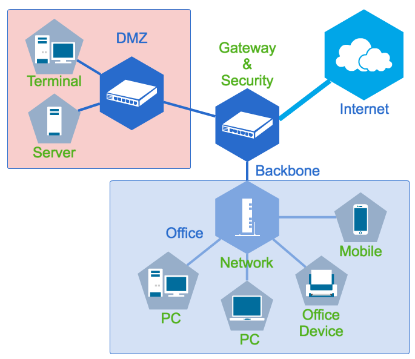
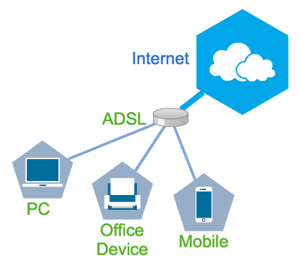
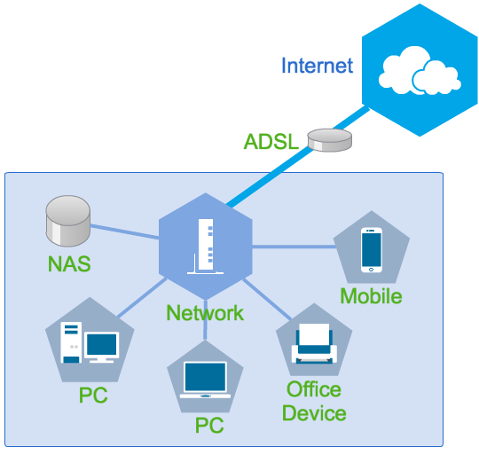
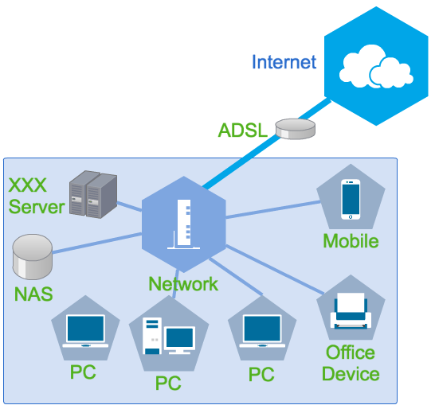
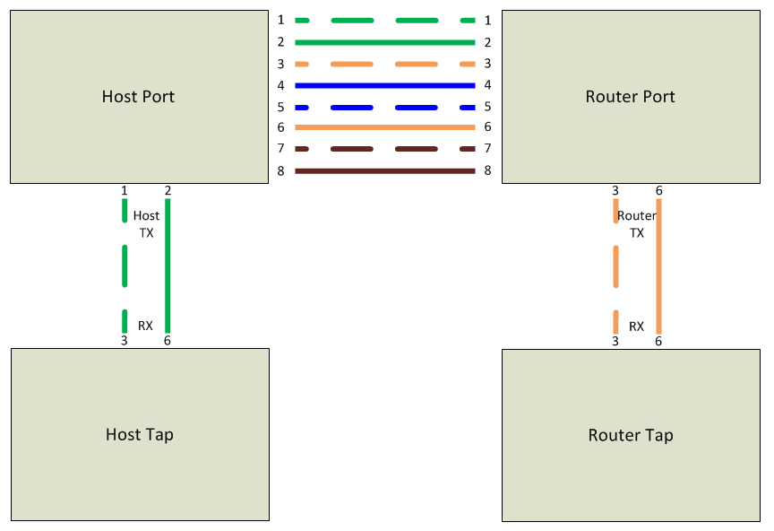
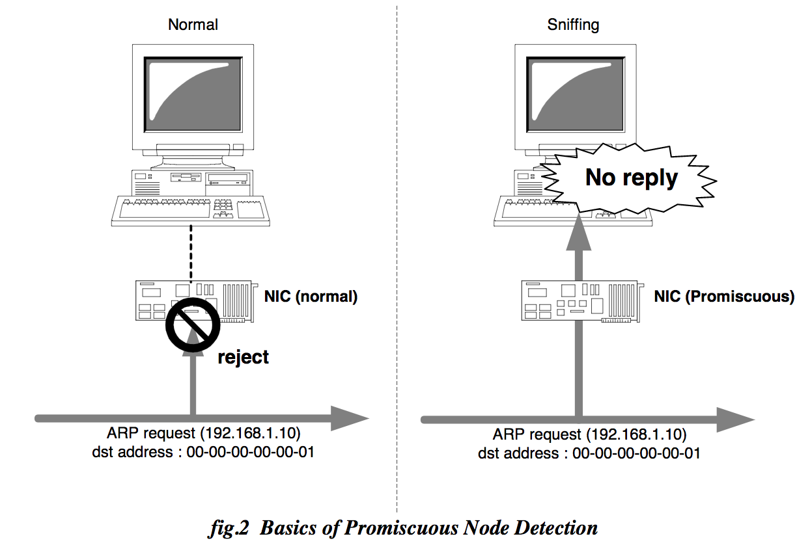
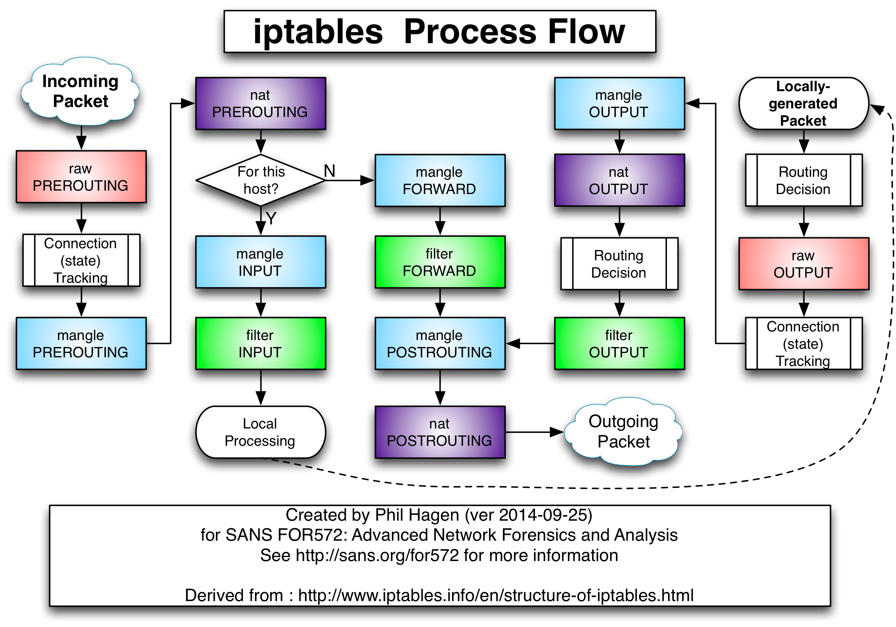

[TOC]

# 網路架構基礎

這裡是資安防禦系列課程的基礎篇，介紹資訊安全的基礎知識

在這裡你會瞭解到：

*   常見網路架構、資安設備、規劃準則
*   什麼是“最危險的目標”
*   常見的網路架構成長路徑

Bonus:

*   防火牆介紹與設置
*   網路竊聽簡介

*   沒時間講ＱＱ

## 必修

電腦網路、**你至少要會用IP分享器**

請能**回答出什麼是：OSI Layer 7、TCP/IP、ARP、路由、交換器、伺服器**

[建議自學方向](https://realdefense.hackpad.com/MRy34vXQV5Q#:h=%E5%BB%BA%E8%AD%B0%E8%87%AA%E5%AD%B8%E6%96%B9%E5%90%91)

_這不是傳統的課程，請不要來“聽課”，腦袋硬梆梆的是做不好資安的，請不吝跟大家分享想法_

另外如果你已經有相當經驗，可以跳過這堂課，但也歡迎來聊天

授權方式 [CC: BY-SA](https://creativecommons.org/licenses/by-sa/3.0/tw/legalcode) 

黑魔法防禦術 FB群組 => https://www.facebook.com/groups/308549376151517

## 網路基礎

基本上，我不想講。

但是我會確定大家都知道：Layer 7、TCP/IP、ARP、路由、交換器、伺服器

*   提問：有沒有人有自己看過封包的？

### 建議自學方向

*   CCNA是不錯的教材
*   自己架一些服務來玩
*   爭取一些管網路的機會，或是自己建立屬於自己的網路
*   遇到問題時，試著往下追，並多跟大家交流碰到了什麼
*   自己看封包很重要，眼見為憑

我想有不少人還沒有自己管理或架設過網路

### 常見的簡化網路架構

### 網路區隔？

用意：

*   效能考量：切割碰撞、廣播領域
*   管理考量：把不同特性的使用者、服務、數據隔開，方便管理

來點名詞解釋

### 常見網路區隔

*   Internet

*   廣域網路

*   Intranet

*   提供內部服務的私有網路，如DMZ
*   https://en.wikipedia.org/wiki/Intranet

*   Extranet

*   協力廠商提供外部服務的網段  EX:B2B

*   骨幹網路

*   連接不同網段的快速交換層
*   在這個區域一般來說只做路由，也不會擺放服務，當成高速公路就是了

*   Office

*   DMZ

*   一般來說是擺放對內部/外部服務的所在網段，也常常是機房的代稱

*   Server farm

*   一般是不提供公開服務的Server網段，也常常是機房的代稱

### 常見網路設備

*   路由器
*   核心交換器

*   基本上很多核心交換器跟路由器都是一體的...（可愛的UTM時代～～笑）

*   交換器

*   可能多解釋這類別的通常是 L3 Switch 居多

*   VPN

*   透過加密通道把Ａ點網路跟Ｂ點連在一起，兩種模式：
*   使用者從外部撥接回內部
*   將Ａ地與Ｂ地的網路連接在一起

*   無線網路

*   難纏但是又不能不用的東西
*   優點：設定一次到處都可以用、不用拉線
*   缺點：效能、干擾、溢波、破解難度低、偽基站
*   詳細會在無線網路安全中討論

*   SDN

### 常見資安設備

這裡是這堂課主要要傳遞的東西

*   邊界防火牆

*   一個網路流量管制裝置，也可以做流量紀錄，一般來說控管Layer 3-4層
*   一般放在組織網路的對外閘道上，如對Internet、對Extranet中間擺放的防火牆都是

*   防火牆

*   一個網路流量管制裝置，也可以做流量紀錄，一般來說控管Layer 3-4層
*   放置在內部網段間的防火牆，或是主機本身內建的防火牆

*   入侵偵測系統（IDS/IDP）

*   透過對網路流量的封包檢查來判斷是不是有潛在的攻擊存在，可以去玩玩snort

*   WAF

*   專門對於Web應用而生的入侵偵測系統，可以做到更深度的檢查與判斷，(Web application firewall)
*   其中一個打WAF的方法就是傳送大量封包
*   很多資安設備是按照流量賣錢的，當流量超過的時候，總不好給你斷線吧，所以就通通給他pass囉

*   DB Auditing

*   稽核所有對資料庫的操作，一般也會有對數據作保護、操作保護等額外功能

*   Tripwire

*   安裝於主機，針對檔案是否被更動置換提出警報，常用在避免網頁被置換，或是重要檔案不被修改
*   感謝GD大大糾正，不是Trapwire QQ

*   DLP

*   資料外洩保護(可做content aware)，大致上分為網路/主機型
*   網路型：偵測網路流量中有沒有符合機敏資料定義的傳輸，並發出告警或攔截
*   主機型：安裝於主機上，藉由攔截OS核心來得知誰、用什麼程式、讀取什麼檔案、做了什麼

*   Anti-Virus

*   防毒軟體，透過病毒碼來偵測檔案是否含有病毒
*   很多防毒軟體也包含sandbox來協助偵測檔案是否含有未知病毒，藉由分析軟體行為來判斷是否異常，但這邊也有很多問題在...

*   Web Filter

*   這是用來針對一般使用者的網路瀏覽行為進行稽核與監控的系統，例如要限制使用者不可以上班時段瀏覽娛樂網站之類 <s>秋後算賬</s>

*   Proxy / Transparent proxy

*   Reverse Proxy

*   Packet Recorder

*   用來記錄封包做之後的分析使用，大多數都是用在除錯、鑑識上面
*   簡單從Wireshark到複雜如Niksun都有，但核心就是封包側錄

*   UTM

*   APT

*   事實上我並不喜歡這個命名... APT原名為進階持續性攻擊，指的是一種駭客的攻擊模式，這個模式乃是由駭客對一個組織的深入瞭解與持續滲透，藉由很多難以發掘的細微行動長期佔領組織內部。這基本上可以稱為是駭客等級的間諜行動。
*   https://zh.wikipedia.org/wiki/%E9%AB%98%E7%BA%A7%E9%95%BF%E6%9C%9F%E5%A8%81%E8%83%81
*   而市面上的APT設備一般來說都只做判別未知的惡意程式，而且一般都專注在郵件系統上，但實際上社交工程郵件只是APT攻擊中的其中一種手法，更不用說判斷能力有限。（貴一點的防毒軟體XD）
*   經典的APT設備使用Sandbox進行惡意程式分析，藉由一組預設或客製化的虛擬環境來執行未知程式，並分析其行為。所以他也有沙箱所有的弱點
*   另一種分析手法乃是藉由拆解檔案中是否含有可執行的二進制編碼，這個的判斷方式還滿強的，不過我沒用過
*   有興趣的話，APT可以另外開一門專門的課程來討論

*   沙箱

*   用在建立一個模擬環境，用來執行不可信任的程式而不會傷害到正式環境，並可對其進行觀察與記錄
*   問題點：
*   ＊惡意程式會執行，沙箱如果可以被繞過，該設備可能會被攻下成為最大的弱點。（命中率100%!）
*   ＊沙箱環境可以被偵測與識別，所以惡意程式可以不執行惡意行為，不被抓出
*   ＊沙箱環境可能與實際環境不同，惡意程式可能在沙箱中無效，但是在實際使用者環境則會爆發
*   Virustotal.com

### 常見服務

對外 / 對內

*   網站
*   FTP
*   郵件
*   資料庫
*   DHCP
*   AD
*   辦公設備

*   列不完的啦，自己去看鳥哥的網站 http://linux.vbird.org/

### 高風險目標

*   每個組織都不一樣，請務必先了解組織特性來羅列高風險目標

*   AD
*   防毒主機
*   資產管理主機
*   內部更新伺服器

*   以上是Checkmate等級的目標

*   資安設備
*   網路設備 
*   經手或儲存高價值資料的主機
*   核心業務主機

*   以上是會讓網管很痛苦的目標

### 接手一個網路，你會想要搞清楚

*   網路的範圍
*   出入口（邊界）
*   每個區段的規劃
*   有哪些網路設備，設定是什麼
*   有哪些資安設備，設定是什麼
*   高風險、高重要性的目標清單
*   每個區段裡面有什麼主機
*   每個區段的使用者的特性

## 網路設計

### 考量

傳輸量、反應時間、靈活性、擴充能力、成本、地理位置、異質網路、失敗復原...

但這些不是我們的考量重點

### 駭客怎麼打？

*    取得內部領地

         *   直接攻擊對外服務並取得權限
     *   透過社交工程直接進入內部網路
     *   透過攻下友軍網路，並透過配置不良的Extranet進入內部網路

*    探索網路環境，找到高價值目標

     *   network scan、Directory List、取得網路設備權限...

*    取得內部權限

     *   NTLM Hash、Sniffing、Key logger、更多社交工程...

*    拿下高價值目標

     *   Checkmate等級的目標

*    潛伏並持續獲取資源

### 安全基礎原則

*   最小化攻擊面 ＆ 最小權限原則
*   釐清每個區段的特性
*   規範不同區段的網路流動
*   透過設備讓這些規範成為現實

### 如何限制流動

#### 偵測

*   Firewall log
*   IDS, WAF, ...

#### 實行

*   Firewall policy
*   Switch ACL
*   IDP, WAF...

#### 稽核

*   用公司規範來達到嚇阻效果

### 常見的錯誤網路配置

*   通通丟在同一個Lan
*   把 Extranet 網路直接接進 Intranet
*   accept any any
*   cisco cisco

*   是說所有東西都同一品牌的問題嗎？
*   預設密碼

*   曼陀珠

*   到處是洞的概念？ 
*   皮脆、心軟、真好嚼

*   免費的最貴

### 實體隔離

*   使用專用的網段放置資安設備

實體隔離代表，該網段*絕對不能*與外部連接，包含其他電腦。如果中間有跳板電腦，那就不能被稱為實體隔離

對實體隔離的攻擊手法：BadUSB、[實體接觸](http://www.freebuf.com/fevents/117599.html) 

對實體隔離的傳輸手法：超音波傳輸、[USB RF電波](http://technews.tw/2016/09/09/wireless-transmitters-are-not-needed-malicious-software-with-usb-cable-to-wireless-transmission/) 

## 你會需要的技能

### CCNA

網路知識是一切的基礎，而CCNA裡面包含了大多數你所需要知道的東西，可以作為不錯的教材

*   CCNA學到一半，你就可以使用很多Hacks了，我會覺得這個學習ＣＰ值相當高
*   不一定要考證照，證照不過是張紙，怎麼應用才是重點

### 架個服務、機房或管個網路

實戰是累積最快的方法

### 封包分析

不要猜，直接去看封包

*   不熟封包結構？請查Wiki
*   Wireshark超好用，你可以tcpdump下來之後用wireshark看

## 網路成長記錄

### Lv.0：網路？什麼網路？

大多數新創、小型企業往往只有兩三台主機或設備，大多數都是申辦個網路，小烏龜上有洞就插，此時跟普通網路用戶沒有什麼兩樣

優勢：扁平化，成本最低，幾乎不需維護，設備少環境單純，幾乎無遠程弱點

弱勢：

*   沒有任何檢測設備與架構，對攻擊無防備
*   容易進行中間人攻擊
*   在這個階段的客戶大多數未曾考慮安全性

### Lv.1：主機好像有點多

開始出現各種奇怪的問題跟需求，開始購置如NAS之類的內部服務裝置開始做資料儲存與協作，不過裡面基本上都還是一坨

*   這時候大家的最愛就是 Teamviewer，也是一個蠻可怕的弱點
*   還有...NAS通常就是無保護的放在DMZ開給大家玩

優勢：扁平化，成本最低，幾乎無遠程弱點

弱勢：

*   沒有任何檢測設備與架構，對攻擊無防備
*   容易中間人攻擊
*   內部的可攻擊點多，不熟悉的設備多
*   惡意程式於內網傳播機率大增
*   機敏性資料開始容易被找到

### Lv.5：開始建造世界奇觀

開始有對外提供服務的需求，但是又不想更動現有架構（或無人可以協助規劃），然後所有東西都塞在一起，這是最容易被入侵的階段，大多數中小企業也都卡在這個階段

優勢：

*   東西好管理，不用搞太多人力

弱勢：

*   開始有外部可直接遠程攻擊的弱點出現
*   沒有任何檢測設備與架構，對攻擊無防備
*   容易中間人攻擊
*   內部的可攻擊點多，不熟悉的設備多
*   惡意程式於內網傳播機率大增
*   敏感資料集中
*   架構開始複雜但一般還是沒有配置負責人

### Lv.10：架構開始成形

開始有了網段的概念，網路流量開始可以被預測與規劃

#### 優勢：

*   流量可被預測與控制

*   很少人這樣做吧...觀念是正確的，但是QoS鮮少被執行...
*   能預測但不一定真的會被實作啊（遠目

*   網路穩定度提升
*   管理複雜度降低
*   提高部分攻擊難度
*   高風險區塊可以被特別關注
*   開始有專門的人來負責網路與主機

#### 缺點：

*   資金投入提高（導入設備）
*   各部門建立各自的網段，可能會遇上政治問題，管理複雜度提高
*   內網攻擊尚無法對抗
*   各電腦尚各自為政，難以統一管理，容易產生弱點
*   尚無法監控發生了什麼事

### Lv.20：導入網路管理架構

員工數量多了起來，各自分散的數百台電腦已經難以一個個人工維護，因此開始導入AD、WSUS、資產管理系統、防毒管理系統等工具，同時因為增加的複雜度，更進階的安全設備也開始被導入

#### 優點：

*   更一致性的管控（病毒更新、上Patch、群組原則、系統設定、使用者控管等）
*   單一簽入允許以使用者身份進行資源管控
*   對資訊流向、特性開始有更深層的認識與控制權

#### 缺點：

*   出現了Checkmate等級的攻擊目標
*   管理者權限已經大到可以一人隻身毀滅一家公司的程度
*   AD就是最大的後門...
*   企業開始需要聘請專家來處理這些高度複雜度的設備

### Lv.50：張開眼睛

到目前為止，所有的一切都還只是設計，實作，然後祈禱。

我該怎麼知道當前的現況是否安全？是否實際運作真的如同設計所預期？現在的異常究竟是自然損毀，還是有人正在打我？我該怎麼回應這一切？

如同人類身上有眾多神經接收資訊，對大型的資訊體來說也是一樣。建構一個神經網路，接收來自組織各地的資訊，並透過大量的數據分析、駭客的知識、管理的經驗來評判，最終給出現況判斷，以及行動方向。

#### 優點：

*   開始能夠正確判斷現況
*   讓資源用在更準確的地方
*   可以有意識地降低資安事件的發生機率與損失

#### 缺點：

*   非常高的建置與維護成本
*   需要真正的專家

*   **Lv.??：巫師**
*   沒有很大，看起來也沒有很炫砲，但是踏進這個領域，請做好心裏準備
*   這裡有陷阱、有魔法，也有神秘的裝置
*   永遠不知道有沒有人正在盯著你看，使用跳板也不一定真的能偽裝什麼
*   我期待能看到這樣的存在

## 進階

估計時間大概不太夠了... 放到網路架構進階去

*   爆炸時，怎麼讓受害範圍縮減在特定區塊？
*   創造出「看不見的區域」是有可能的嗎？
*   製造陷阱
*   如何在對方進入你創造的世界時，一舉一動都被你所監視？
*   防火牆的區域聯防
*   "你的設備真的安全嗎....?"
*   攻性防壁 是有可能的？

**消失的密室：一個無法被感知的監聽網路**

## 網路竊聽

### 傳統上的竊聽手法

#### 基本工具

tcpdump / [Wireshark](https://www.wireshark.org/download.html) 

##### 你有管理權限：

Port Mirror

Tapping

##### 你沒有管理權限：

Fake AP

Switch ARP Cache overflow

ARP [Scan](http://wenson.iteye.com/blog/801379)  and [spoofing](https://en.wikipedia.org/wiki/ARP_poisoning) 

attack switch device

attack routing

attack target host

attack by specific application

*   e.g. Web Proxy Auto Detect ([WPAD](https://en.wikipedia.org/wiki/Web_Proxy_Autodiscovery_Protocol#Security) ) 
*   e.g. DNS Spoofing

#### Tap：一個在網路上進行分流的裝置

三種網路的Tap

*   Cable: Vampire tap http://pluto.ksi.edu/~cyh/cis370/ebook/ch02b.htm

http://www.certiguide.com/apfr/diagrams/figure422.png

*   光纖: https://en.wikipedia.org/wiki/Fiber_tapping

http://cdn.ttgtmedia.com/informationsecurity/images/vol2iss11/ism_vol2iss11_f4-fiberhack.jpg

http://andrewmallett.net/tech/networks/pinouts.gif

* 1000 並沒有明確區分輸入輸出腳位，所以沒有辦法做被動式的tapping
* 實作Passive RJ45 Tap
* http://www.instructables.com/id/Make-a-Passive-Network-Tap/?ALLSTEPS
* http://www.fragmentationneeded.net/2012/01/ethernet-taps-dont-get-me-started.html

* 
  </ul class="comment">

* http://2.bp.blogspot.com/-mXuaUa65yTo/VA45KtqXSXI/AAAAAAAAEjs/ch9-CaNcw0g/s1600/Network%2BTap.jpg

嗯....把傳送與接收分開來錄，結果兩邊都只看到一半，怎麼辦？

#### 封包重組

*   mergepcap -a 1.pcap 2.pcap -w result.pcap

或直接於Wireshark： File -> Merge

嗯？為什麼要花這麼多功夫做這些事情來竊聽？直接開Wireshark來聽不好嗎？

#### 竊聽偵測技術

http://www.securityfriday.com/promiscuous_detection_01.pdf

https://nmap.org/nsedoc/scripts/sniffer-detect.html

*   nmap -sV --script=sniffer-detect <target>

*   大夥，竊聽不難，流量要記得加密啊....

## 延伸講義：防火牆與防火牆規則

*   大概來不及講...拆成獨立章節？

問：有沒有用過防火牆的？

### 基礎防火牆

封包過濾 -> 狀態感知 -> 應用感知

一般防火牆可以處理Layer 3-4的內容（IP/Port），也提供一些如NAT之類的功能

特別一點的，可以處理Layer 2，或Layer 5-7的內容

*   iptables
*   ebtables

#### 先釐清

*   區域規劃
*   開放什麼服務、什麼協定、給誰
*   什麼地方有什麼流量要到什麼地方

#### 大原則

*   Default drop
*   Simple filter first
*   Log if possible

#### 防火牆該放在什麼地方

網路的邊界、區域的邊界、主機的邊界

任何你想要記錄流量的地方

#### 免費的防火牆

*   所有Linux內建的iptables
*   所有BSD內建到IPFW
*   所有Windows也有內建防火牆：從XP SP2開始
*   pfsense 

#### 企業級防火牆？

*   穩定、穩定、穩定
*   效能
*   報表
*   Log

#### UTM的防火牆？

功能 v.s. 效能、安全性、穩定性

*   防火牆就是防火牆，別亂塞東西！

特殊功能：多WAN、解SSL、IDS、WebFilter、WAF、DLP、APT、Anti-Virus.....你想得到他她都能塞進去

優勢：較佳的整合，單一介面管控所有

缺點：效能、深度

#### Iptable sample

# 預設原則

*   iptables -P OUTPUT ACCEPT      # 可以的話，連對外都不要預設accept
*   iptables -P INPUT DROP
    **   # 過濾不正常流量（基本偽裝防護）
*   iptables -F
*   iptables -A INPUT -p tcp --tcp-flags ALL NONE -j DROP
*   iptables -A INPUT -p tcp ! --syn -m state --state NEW -j DROP
*   iptables -A INPUT -p tcp --tcp-flags ALL ALL -j DROP
    **   # 開放本地流量
*   iptables -A INPUT -i lo -j ACCEPT
    **   # 開放公開服務 （封包過濾）
*   iptables -A INPUT -p tcp -m tcp --dport 80 -j ACCEPT
*   iptables -A INPUT -p tcp -m tcp --dport 443 -j ACCEPT
    **   # 指定範圍開放服務
*   iptables -A INPUT -p tcp -s YOUR_IP_ADDRESS -m tcp --dport 22 -j ACCEPT
    **   # 允許已被認可的TCP流量通過 （狀態感知）
*   iptables -I INPUT -m state --state ESTABLISHED,RELATED -j ACCEPT

圖片來源：

http://www.4e00.com/blog/img/linux/iptables/iptables-process-flow.png