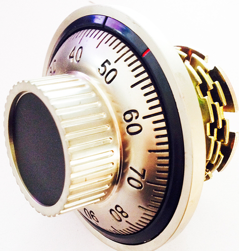
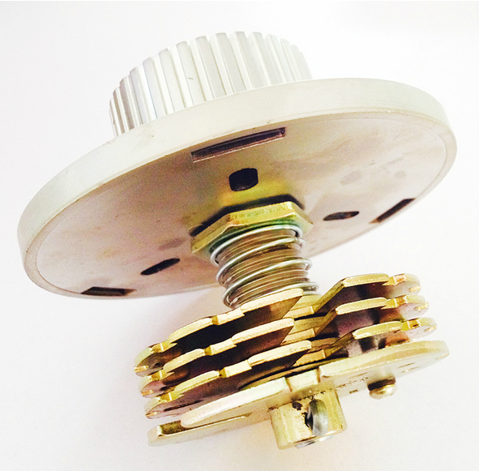
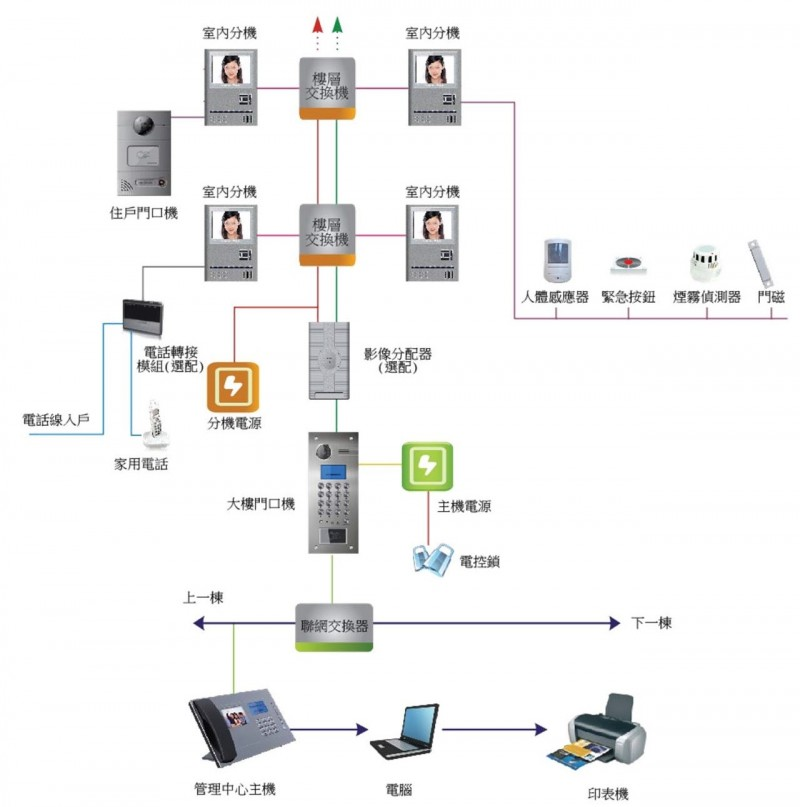

# 實體安全

怎麼開鎖、怎麼直接敲下整扇門、怎麼繞過攝影機、怎麼讓攝影機瞎掉、怎麼避開窗戶震動感應器、怎麼直接切斷大樓的保全通訊.... 知道對方怎麼敲你，你才有辦法真正回應攻擊

### ``` 本日重點：大家一起玩開鎖 ```

## 基本保護





*   門閂
*   旅館常見的門扣

    *   鐵桿
*   鏈條式
    *   內藏鎖鏈

*   RFID
*   電子密碼鎖
*   門
*   鐵捲門
*   鐵窗
*   牆壁
*   保險箱
*   Man Trap
*   警衛亭
*   監視器

### 安全是基於

*   在有限的時間之內無法被解開（引起注意）
*   破解時可能觸發噪音
*   延緩行動
*   偵測行動
*   最終還是要有人來處理

## 關於保全公司

### 基礎架構



### 常見終端

*   門、窗開啟感應
*   窗戶破裂感應
*   紅外線遮斷通過警報
*   門禁通報
*   手動呼叫鈕
*   即時影像

    *   紅外線夜視
*   紅外線探照燈
    *   移動感測

*   警衛亭

### 安全是基於

*   偵測異常
*   N分鐘之內會有人趕來應變

## Bug

### 鎖與大門

*   [锡纸开锁](http://www.baike.com/wiki/%E9%94%A1%E7%BA%B8%E5%BC%80%E9%94%81)，是一种新型“开锁”手段，主要以[一字锁](http://www.baike.com/wiki/%E4%B8%80%E5%AD%97%E9%94%81)、十字锁和AB锁为主要对象。锡纸开锁需要借助专门的锡纸[工具](http://www.baike.com/wiki/%E5%B7%A5%E5%85%B7)，由于锡纸的韧性在锁体内能随着[弹子锁](http://www.baike.com/wiki/%E5%BC%B9%E5%AD%90%E9%94%81)锁齿的牙花变形，并咬合在牙花上，所以能很快地打开门锁
     **   對抗方法：用安全级别高的锁
*   门锁一般分为三个级别：
*   A级，技术开启超过一分钟，暴力开启十五分钟以上（算合格）。
*   B级，技术开启超过五分钟，暴力开启三十分钟以上（算合格）。
*   超B级（C级），开启时间要长一点，最多是270分钟。
*   B级锁和超B级锁，开启难度相对较大，窃贼多半不喜欢，会选择直接放弃，因此相对安全。

*   大門基本原理

     *   絞鍊
*   暴力破解

*   門扣

     *   [](http://www.ettoday.net/dalemon/post/4387)http://www.ettoday.net/dalemon/post/4387

*   牆壁

     *   美國電影總是把人丟出去撞破牆壁

### 後門

*   通風管道

### 關於終端設備

*   磁簧曬太久
*   15k歐姆終端電阻
*   繞過震動感應
*   攝影系統

    *   強光手電筒
*   綠光雷射
    *   無線通訊攔截
    *   Cable v.s. 吸血鬼

### 關於通訊

*   電話專線

    *  非緊急回應時間 15min

    *   通訊延遲時間20秒
    *   畢竟是電話，炸了本地配線盤就（下略

### 關於警衛

*   回應時間：黃金三分鐘
*   交通尖峰期
*   DDoS：颱風天

### 其他

* 迷你倉
* 銀行保險庫

